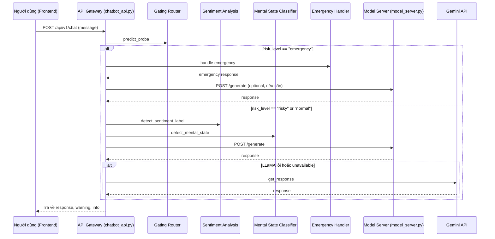

# 📚 Tổng Quan API, Router, Endpoint & Luồng Dữ Liệu Hệ Thống Chatbot

## 1. Kiến trúc tổng thể

```
Frontend (UI, Gradio, Web)
   |
   |  POST /api/v1/chat
   v
API Gateway (FastAPI app)
   |
   |---> Router (chatbot_api.py, prefix /api/v1)
           |
           |---> Endpoint: /chat (POST)
                   |
                   |---> Gating Router (ML model) để phân loại mức độ nguy hiểm
                   |---> Gọi các service khác nếu cần (sentiment, mental, emergency...)
                   |---> Gọi Model Server (nếu cần)
                   |---> Tổng hợp kết quả trả về frontend
```

## 2. Vai trò các thành phần

- **Frontend**: Giao diện người dùng, gửi/nhận tin nhắn.
- **API Gateway**: Trung tâm điều phối, nhận message từ frontend, gọi các service, trả kết quả về frontend.
- **Router**: Tổ chức các endpoint trong code (ví dụ: router trong `chatbot_api.py` với prefix `/api/v1`).
- **Endpoint**: Đường dẫn cụ thể mà frontend/backend gọi (ví dụ: `/api/v1/chat`).
- **Gating Router**: Model ML phân loại mức độ rủi ro của tin nhắn.
- **Model Server**: Serve model AI (LLaMA), chỉ nhận request từ API Gateway.
- **Gemini API**: Fallback khi Model Server lỗi.
- **Emergency Handler**: Xử lý khẩn cấp, cảnh báo, gọi hotline.

## 3. Danh sách các API, router, endpoint chính

### A. API Gateway (port 8000)
- **Router chính**: `router = APIRouter()` trong `chatbot_api.py`, include vào app với prefix `/api/v1`.
- **Endpoint chính:**
  - `POST /api/v1/chat` — Nhận message, xử lý toàn bộ pipeline.
  - `GET /api/v1/api-stats` — Lấy thống kê API usage, health các service.
  - `GET /api/v1/health` — Health check các service phụ trợ.
  - (Đã loại bỏ: `/api/v1/generate-direct`)

### B.API Model Server (port 8001)
- **Endpoint chính:**
  - `POST /generate` — Sinh phản hồi từ LLaMA model.
  - `GET /health` — Health check Model Server.
  - `GET /model-info` — Lấy thông tin về model đang serve.

### C. Các service nội bộ (không expose endpoint riêng)
- **Gating Router**: Được gọi trong code để phân loại risk_level.
- **Sentiment Analysis**: Phân tích cảm xúc.
- **Mental State Classifier**: Phân loại trạng thái tâm thần.
- **Emergency Handler**: Xử lý khẩn cấp.

## 4. Luồng đi của dữ liệu (chi tiết)

### 1. User gửi tin nhắn trên frontend
- Frontend gửi request HTTP (POST) đến `/api/v1/chat`.

### 2. API Gateway nhận request
- Tìm router phù hợp với đường dẫn (`/api/v1/chat`).
- Router này được định nghĩa trong `chatbot_api.py` với prefix `/api/v1`.

### 3. Endpoint `/api/v1/chat` xử lý:
- Gọi **Gating Router** để xác định `risk_level` (bình thường, rủi ro, khẩn cấp).
- Nếu `risk_level == "normal"`:
  - Gọi Model Server luôn, không phân tích sentiment/mental_state.
- Nếu `risk_level != "normal"`:
  - Gọi thêm các hàm phân tích cảm xúc và trạng thái tâm thần.
  - Gọi Model Server với prompt có thêm thông tin cảm xúc, trạng thái.
- Nếu Model Server lỗi, fallback sang Gemini API.
- Nếu `risk_level == "emergency"`, gọi Emergency Handler để xử lý khẩn cấp.
- Tổng hợp kết quả, cảnh báo, warning, trả về frontend.

### 4. Model Server xử lý:
- Nhận request tại endpoint `/generate`.
- Sinh phản hồi từ model (LLaMA) và trả về cho API Gateway.

### 5. Frontend nhận và hiển thị phản hồi:
- Nhận JSON response từ backend, hiển thị message bot, cảnh báo, gợi ý, ...

## 5. Bảng tổng hợp endpoint, router, API

| Thành phần      | Endpoint/Router           | Chức năng chính                        |
|-----------------|--------------------------|----------------------------------------|
| API Gateway     | `/api/v1/chat`           | Xử lý hội thoại, điều phối pipeline    |
|                 | `/api/v1/api-stats`      | Thống kê API, health các service       |
|                 | `/api/v1/health`         | Health check các service phụ trợ       |
| Model Server    | `/generate`              | Sinh phản hồi từ LLaMA                 |
|                 | `/health`                | Health check Model Server              |
|                 | `/model-info`            | Thông tin model                        |
| Nội bộ          | Gating Router            | Phân loại mức độ rủi ro                |
|                 | Sentiment Analysis       | Phân tích cảm xúc                      |
|                 | Mental State Classifier  | Phân loại trạng thái tâm thần          |
|                 | Emergency Handler        | Xử lý khẩn cấp                         |

## 6. Các lưu ý và giải thích khái niệm

- **API Gateway** là API server FastAPI, không phải router. Router chỉ là thành phần tổ chức endpoint trong code.
- **Endpoint** là đường dẫn cụ thể mà frontend/backend gọi.
- **Gating Router** là model ML, không phải router FastAPI.
- **Luồng đi chuẩn:**
  - Frontend → API Gateway (`/api/v1/chat`) → [Gating Router, các service phân tích] → Model Server (`/generate`) → API Gateway → Frontend
- **Không nên gọi Model Server trực tiếp từ frontend.**
- **Không nên để API Gateway load model lớn (chỉ nên gọi Model Server qua HTTP).**
- **Đã loại bỏ endpoint `/api/v1/generate-direct` để đảm bảo kiến trúc microservice sạch.**

## 7. Sơ đồ sequence chi tiết



## 8. Các trường hợp đặc biệt
- Nếu Model Server lỗi, API Gateway sẽ fallback sang Gemini API.
- Nếu user có dấu hiệu khẩn cấp, API Gateway sẽ gọi Emergency Handler và ưu tiên cảnh báo.
- Nếu chỉ test model, có thể dùng script test/dev riêng, không cần endpoint generate-direct.

---

**Tài liệu này tổng hợp toàn bộ kiến thức về API, router, endpoint, luồng đi, các trường hợp đặc biệt và lưu ý thực tế trong hệ thống chatbot này.**
Nếu cần bổ sung chi tiết code hoặc ví dụ cụ thể, hãy tham khảo các file: `api_gateway/chatbot_api.py`, `model_server.py`, `services/chatbot/llama_service.py`, `services/chatbot/gemini_service.py`. 