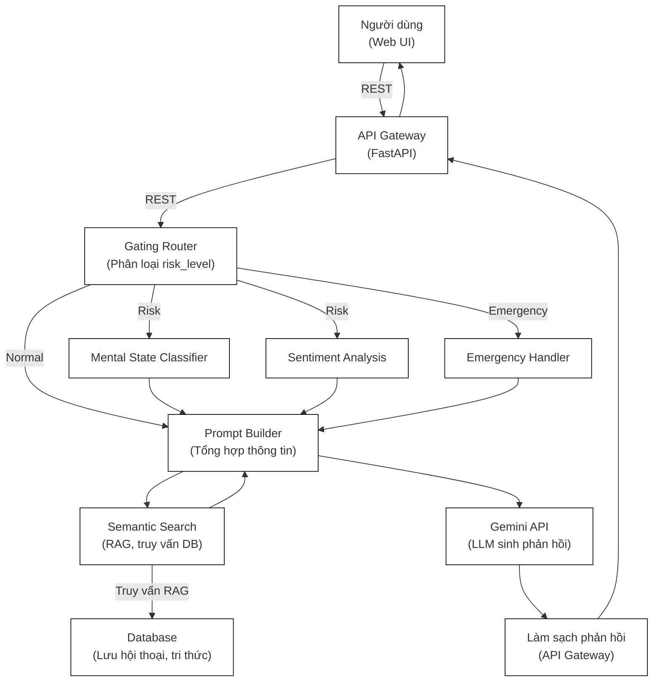

# 🧠 Mental Health Chatbot

**Mental Health Chatbot** là hệ thống hỗ trợ tâm lý ứng dụng AI, sử dụng mô hình ngôn ngữ lớn (LLM) và các tầng phân tích rủi ro để đảm bảo an toàn, cá nhân hóa phản hồi và xử lý khẩn cấp khi cần thiết.

---

## 🚦 Kiến trúc & Flow tổng quan

Hệ thống chatbot được thiết kế với các tầng xử lý rõ ràng, đảm bảo an toàn, cá nhân hóa và phản hồi linh hoạt. Sơ đồ dưới đây thể hiện kiến trúc tổng quan, chức năng từng module và luồng xử lý chính:



### Chức năng từng module:
- **Người dùng (Web UI)** (*Giao diện trò chuyện cho người dùng cuối*)
- **API Gateway (FastAPI)** (*Trung tâm điều phối, nhận message qua REST, gọi các service, làm sạch phản hồi*)
- **Gating Router** (*Phân loại mức độ rủi ro: Normal, Risk, Emergency cho từng message*)
- **Mental State Classifier** (*Phân loại trạng thái tâm thần, phát hiện dấu hiệu bất thường*)
- **Sentiment Analysis** (*Phân tích cảm xúc, hỗ trợ cá nhân hóa phản hồi*)
- **Emergency Handler** (*Xử lý khẩn cấp, cảnh báo, gọi hotline, ghi log sự kiện nguy hiểm*)
- **Semantic Search (RAG)** (*Truy vấn database để lấy thông tin liên quan, bổ sung vào prompt*)
- **Database** (*Lưu lịch sử hội thoại, tri thức, log, cảnh báo*)
- **Prompt Builder** (*Tổng hợp tất cả thông tin: message, risk level, cảm xúc, trạng thái, tri thức từ DB*)
- **Gemini API** (*LLM chính sinh phản hồi dựa trên prompt hoàn chỉnh*)
- **Làm sạch phản hồi** (*Chuẩn hóa, format phản hồi trước khi trả về UI*)


### Luồng xử lý chính:
1. **User** gửi message qua Web UI
2. **API Gateway** nhận message qua REST, chuyển cho **Gating Router**
3. **Gating Router** phân loại risk_level:
   - **Normal:** → Tạo prompt trực tiếp
   - **Risk:** → Gọi **Mental State Classifier** & **Sentiment Analysis** để phân tích trạng thái tâm thần và cảm xúc, sau đó mới tạo prompt
   - **Emergency:** → Gọi **Emergency Handler** để cảnh báo, đồng thời thêm thông tin vào prompt
4. **Semantic Search** truy vấn DB (RAG) để lấy thông tin liên quan, bổ sung vào prompt
5. **Prompt Builder** tổng hợp tất cả thông tin thành prompt hoàn chỉnh
6. **Gemini API** sinh phản hồi dựa trên prompt → trả về **API Gateway**
7. **API Gateway** làm sạch, chuẩn hóa phản hồi → gửi về **UI** cho người dùng

> Sơ đồ trên giúp người mới dễ hình dung toàn bộ luồng xử lý và vai trò từng thành phần trong hệ thống chatbot AI hỗ trợ tâm lý.

---

## 🏗️ Kiến trúc Model Server

Hệ thống sử dụng **LLM Server** riêng biệt để serve fine-tuned MentalGPT model:

```
┌─────────────────┐    ┌──────────────────┐    ┌─────────────────┐
│   Frontend      │    │  API Gateway     │    │ LLM Server      │
│   (Web UI)      │◄──►│  (FastAPI)       │◄──►│  (MentalGPT)    │
│                 │    │  Port: 8000      │    │  Port: 8001     │
└─────────────────┘    └──────────────────┘    └─────────────────┘
```

### Components:

#### 1. LLM Server (`llmserver/main.py`)
- **Port**: 8001
- **Model**: NV9523/MentalGPT (Fine-tuned LLaMA model)
- **Chức năng**: Serve fine-tuned model với streaming response
- **Endpoints**:
  - `POST /model/generate/` - Generate streaming response
  - **Request Format**:
    ```json
    {
      "prompt": "User message...",
      "max_new_tokens": 1024
    }
    ```
  - **Response**: Streaming text response

#### 2. API Gateway (`api_gateway/api.py`)
- **Port**: 8000
- **Chức năng**: Main API với tích hợp đầy đủ các services
- **Endpoints**:
  - `POST /api/v1/chat` - Main chat endpoint (từ chatbot_api.py)
  - `POST /chat` - Legacy chat endpoint
  - `GET /health` - Health check
  - `GET /api-stats` - API statistics
  - `POST /emergency` - Emergency handling
  - `POST /semantic_search` - RAG search
  - `GET /context/{user_id}` - Get conversation context
  - `DELETE /context/{user_id}` - Clear conversation context

#### 3. API Request/Response Format

**Request từ Web UI:**
```json
{
  "message": "Tôi cảm thấy căng thẳng...",
  "user_id": "user_123",
  "session_id": "session_1234567890",
  "history": [
    {"role": "user", "content": "..."},
    {"role": "assistant", "content": "..."}
  ]
}
```

**Response từ API Gateway:**
```json
{
  "response": "Tôi hiểu cảm xúc của bạn...",
  "sentiment": "negative",
  "mental_state": "anxiety",
  "risk_level": "normal|risky|emergency",
  "warning": "⚠️ RỦI RO: Gợi ý liên hệ chuyên gia..."
}
```

#### 4. Processing Pipeline

1. **Gating Router** (`services/gating_router/`) - Phân loại risk level
2. **Sentiment Analysis** (`services/setiment_analysis/`) - Phân tích cảm xúc
3. **Mental State Classifier** (`services/mental_state_classifier/`) - Phân loại trạng thái tâm thần
4. **Prompt Builder** - Tổng hợp context và tạo prompt
5. **LLM Generation** - Gọi MentalGPT model
6. **Response Processing** - Xử lý và format phản hồi

#### 5. Risk Level Handling
- **Normal**: Phản hồi bình thường
- **Risky**: ⚠️ RỦI RO + gợi ý liên hệ chuyên gia
- **Emergency**: 🚨 KHẨN CẤP + cảnh báo hotline + phản hồi hỗ trợ

#### 6. Model Configuration
- **Base Model**: LLaMA với PEFT adapter
- **Fine-tuned Model**: NV9523/MentalGPT
- **Device**: CUDA (GPU) với torch.float16
- **Generation Parameters**:
  - Temperature: 0.1
  - Top-k: 50
  - Top-p: 0.95
  - Repetition penalty: 1.0

---

## 📦 Cấu trúc thư mục đã tối ưu hóa

> **🎯 Repository đã được tối ưu hóa:** Loại bỏ 12 files không cần thiết, dọn dẹp cache, và cập nhật .gitignore để bỏ qua các file lớn (Dataset/, Notebook/, models/weights/).

```bash
DoAnTotNghiep/
├── 📁 api_gateway/           # API Gateway (FastAPI backend)
│   ├── __init__.py
│   ├── api.py               # Main API server
│   └── chatbot_api.py       # Chatbot-specific routes
├── 📁 Database/             # Quản lý database
│   └── core.py
├── 📁 Dataset/              # Dữ liệu huấn luyện/thô (git-ignored)
├── 📁 Docs/                 # Tài liệu dự án
│   └── API.md
├── 📁 llmserver/            # LLM Server (Model inference)
├── 📁 logs/                 # Log files
├── 📁 models/               # Định nghĩa & trọng số model
│   ├── __init__.py
│   └── weights/             # Trọng số model (git-ignored)
├── 📁 Notebook/             # Notebook Jupyter (git-ignored)
├── 📁 Reference/            # Tài liệu tham khảo
│   └── Section-I-TV-20230531.pdf
├── 📁 scripts/              # Script hỗ trợ huấn luyện, inference, cài đặt
│   ├── download_alternative_model.py
│   ├── download_base_model.py
│   ├── embed_articles_to_qdrant.py
│   ├── install_dependencies.py
│   └── reorganize_models.py
├── 📁 services/             # Các service lõi
│   ├── __init__.py
│   ├── chatbot/             # Logic chatbot
│   ├── common_schemas.py
│   ├── context_tracking/    # Theo dõi ngữ cảnh hội thoại
│   │   └── tracker.py
│   ├── emergency_handler/   # Xử lý khẩn cấp
│   │   ├── __init__.py
│   │   ├── handler.py
│   │   ├── hotline_caller.py
│   │   ├── README.md
│   │   └── staff_notifier.py
│   ├── gating_router/       # Định tuyến/phân loại rủi ro
│   │   ├── __init__.py
│   │   ├── prompt_builder.py
│   │   ├── quick_check.py
│   │   └── router.py
│   ├── mental_state_classifier/ # Phân loại trạng thái tâm thần
│   │   ├── classifer.py
│   │   ├── config/
│   │   │   ├── labels.json
│   │   │   ├── settings.py
│   │   │   └── thresholds.json
│   │   └── utils/
│   │       └── text_preprocessor.py
│   ├── semantic_search.py   # Tìm kiếm ngữ nghĩa (RAG)
│   └── setiment_analysis/   # Phân tích cảm xúc
│       └── analyzer.py
├── 📁 train/                # Huấn luyện model
├── 📁 UI/                   # Giao diện người dùng
│   ├── main.py
│   └── templates/
│       └── index.html       # Template UI
├── 📁 utils/                # Tiện ích chung
│   ├── __init__.py
│   ├── api_manager.py
│   ├── common.py
│   ├── data_loader.py
│   ├── logger.py
│   └── token_loader.py
├── 📄 index.html            # Giao diện người dùng chính (Web UI)
├── 📄 chatbot.db            # Database SQLite
├── 📄 config.py             # File cấu hình chung
├── 📄 docker-compose.data.yml # Docker cho database (Qdrant + MongoDB)
├── 📄 download_llama_model.py # Script tải model LLaMA
├── 📄 env.example           # Mẫu file biến môi trường
├── 📄 generate_dataset_chatbot.txt # Hướng dẫn tạo dataset
├── 📄 init_database.py      # Khởi tạo database
├── 📄 pyproject.toml        # Cấu hình Python project
├── 📄 requirements.txt      # Danh sách thư viện
├── 📄 run_servers.py        # Chạy toàn bộ server
└── 📄 token.env             # File token môi trường (git-ignored)
```

---

## ⚡️ Cài đặt & chạy thử

### 1. Clone repo & cài thư viện
```bash
git clone https://github.com/your-username/mental-health-chatbot.git
cd mental-health-chatbot
pip install -r requirements.txt
```

### 2. Thiết lập biến môi trường
Tạo file `.env` từ mẫu `.env.example` và điền các thông tin:
```env
GEMINI_API_KEY=your_gemini_key
DATABASE_URL=sqlite:///chatbot.db
DEBUG=true
```

### 3. Chạy hệ thống

#### Cách 1: Chạy với Uvicorn (Development)
```bash
# Chạy API Gateway
uvicorn api_gateway.api:app --host 0.0.0.0 --port 8000 --reload

# Chạy Model Server (nếu cần)
uvicorn llmserver.main:app --host 0.0.0.0 --port 8001 --reload
```

#### Cách 2: Chạy Database với Docker (Tùy chọn)
```bash
# Chạy Qdrant và MongoDB database (nếu cần)
docker-compose -f docker-compose.data.yml up -d
```

### 4. Truy cập và test hệ thống

#### Web UI
```bash
# Mở trình duyệt và truy cập
http://localhost:8000
# hoặc mở file index.html trực tiếp
```

#### Test API Endpoints
```bash
# Health check
curl http://localhost:8000/health

# Chat endpoint
curl -X POST http://localhost:8000/chat \
  -H "Content-Type: application/json" \
  -d '{
    "user_input": "Tôi cảm thấy căng thẳng về công việc",
    "history": [],
    "session_id": "test_session_123"
  }'
```

#### Response mẫu
```json
{
  "bot_response": "Tôi hiểu bạn đang cảm thấy căng thẳng...",
  "risk_level": "normal",
  "sentiment": "negative",
  "mental_state": "anxiety"
}
```

---

## 📊 API Response Format

```json
{
  "bot_response": "Tôi hiểu cảm xúc của bạn...",
  "risk_level": "normal|risky|emergency",
  "sentiment": "positive|negative|neutral",
  "mental_state": "depression|anxiety|normal",
  "session_id": "session_1234567890",
  "timestamp": "2024-01-01T12:00:00Z"
}
```

### Risk Level Display:
- **Normal**: Phản hồi bình thường
- **Risky**: ⚠️ RỦI RO + phản hồi
- **Emergency**: 🚨 KHẨN CẤP + phản hồi + cảnh báo

---


