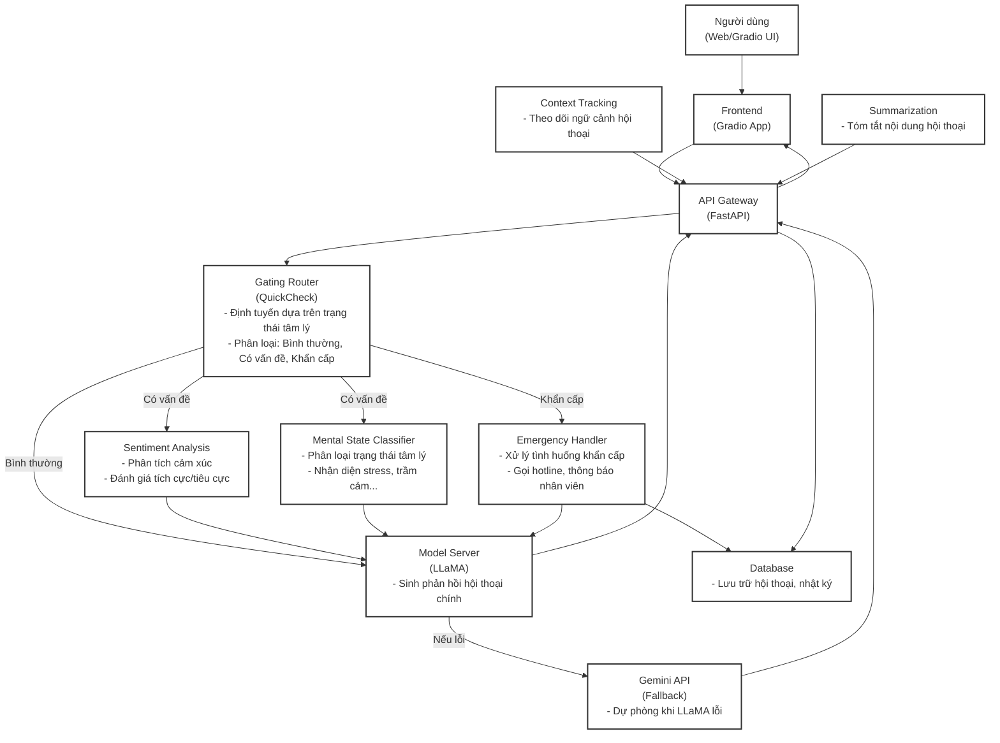

# 🤖 Hệ Thống Chatbot Tư Vấn Tâm Lý - Tổng Quan & Kiến Trúc

## 1. Giới thiệu

Hệ thống Chatbot Tư Vấn Tâm Lý là một nền tảng hỗ trợ người dùng chia sẻ cảm xúc, nhận phân tích trạng thái tâm lý và được tư vấn phù hợp. Hệ thống tích hợp nhiều module AI, xử lý ngôn ngữ tự nhiên, phân tích cảm xúc, phát hiện khẩn cấp và lưu trữ hội thoại.

## 2. Kiến trúc tổng quát



## 3. Chức năng từng module

- **Người dùng (Web/Gradio UI):** Giao diện trò chuyện thân thiện, nhập tin nhắn và nhận phản hồi.
- **Frontend (Gradio App):** Ứng dụng giao diện người dùng, gửi/nhận dữ liệu với API Gateway.
- **API Gateway (FastAPI):** Trung tâm tiếp nhận, phân phối yêu cầu, bảo mật và tích hợp các module phía sau.
- **Gating Router (QuickCheck):** Định tuyến thông minh dựa trên trạng thái tâm lý, phân loại hội thoại sang các nhánh phù hợp.
- **Sentiment Analysis:** Phân tích cảm xúc (tích cực, tiêu cực, trung tính) từ tin nhắn người dùng.
- **Mental State Classifier:** Phân loại trạng thái tâm lý (stress, trầm cảm, bình thường, v.v.).
- **Emergency Handler:** Phát hiện và xử lý tình huống khẩn cấp, gọi hotline hoặc thông báo nhân viên hỗ trợ.
- **Model Server (LLaMA):** Sinh phản hồi hội thoại chính, xử lý ngôn ngữ tự nhiên.
- **Gemini API (Fallback):** API dự phòng khi LLaMA gặp lỗi hoặc quá tải.
- **Database:** Lưu trữ hội thoại, nhật ký, log sự kiện khẩn cấp.
- **Context Tracking:** Theo dõi ngữ cảnh hội thoại, giúp phản hồi chính xác hơn.
- **Summarization:** Tóm tắt nội dung hội thoại, hỗ trợ tổng hợp thông tin.

## 4. Hướng dẫn cài đặt nhanh

```bash
# 1. Cài đặt Python >=3.8 và pip
# 2. Cài đặt các thư viện cần thiết
pip install -r requirements.txt

# 3. Chạy API Gateway (FastAPI)
cd api_gateway
python main.py

# 4. Chạy Frontend (Gradio UI)
cd ../frontend
python app.py

# 5. (Tùy chọn) Chạy các model server, database, ... theo docker-compose
cd ..
docker-compose up
```

## 5. Liên hệ & Hỗ trợ

- **Hotline hỗ trợ:** 0984.104.115
- **Email:** support@mentalhealth.com
- **Tài liệu API:** ./Docs/API.md

---

> Hệ thống được phát triển phục vụ mục đích hỗ trợ tâm lý, không thay thế chuyên gia y tế. Nếu bạn hoặc người thân gặp nguy hiểm, hãy liên hệ ngay các cơ quan chức năng hoặc chuyên gia y tế gần nhất. 