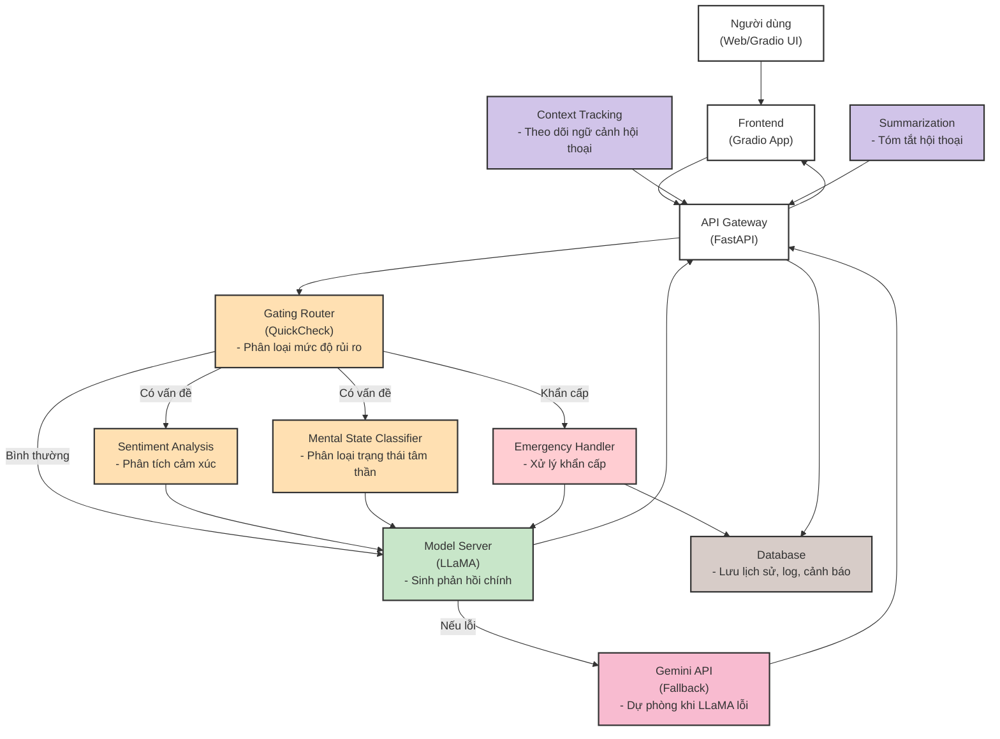

# 🧠 Mental Health Chatbot

**Mental Health Chatbot** là hệ thống hỗ trợ tâm lý ứng dụng AI, sử dụng mô hình ngôn ngữ lớn (LLM) và các tầng phân tích rủi ro để đảm bảo an toàn, cá nhân hóa phản hồi và xử lý khẩn cấp khi cần thiết.

---

## 🚦 Kiến trúc & Flow tổng quan

Hệ thống chatbot được thiết kế với các tầng xử lý rõ ràng, đảm bảo an toàn, cá nhân hóa và phản hồi linh hoạt. Sơ đồ dưới đây thể hiện kiến trúc tổng quan, chức năng từng module và luồng xử lý chính:



### Chức năng từng module:
- **Người dùng (Web/Gradio UI):** Giao diện trò chuyện cho người dùng cuối.
- **Frontend (Gradio App):** Hiển thị hội thoại, gửi/nhận message, hiển thị cảnh báo.
- **API Gateway (FastAPI):** Trung tâm điều phối, nhận message, gọi các service, trả kết quả về frontend.
- **Gating Router (QuickCheck):** Phân loại mức độ rủi ro (bình thường, có vấn đề, khẩn cấp) cho từng message.
- **Sentiment Analysis:** Phân tích cảm xúc, hỗ trợ cá nhân hóa phản hồi.
- **Mental State Classifier:** Phân loại trạng thái tâm thần, phát hiện dấu hiệu bất thường.
- **Emergency Handler:** Xử lý khẩn cấp, cảnh báo, gọi hotline, ghi log sự kiện nguy hiểm.
- **Model Server (LLaMA):** Chatbot chính, sinh phản hồi tự nhiên, thông minh.
- **Gemini API (Fallback):** Chatbot dự phòng, dùng khi LLaMA lỗi hoặc cần đa dạng nguồn trả lời.
- **Database:** Lưu lịch sử hội thoại, log, cảnh báo, trạng thái user.
- **Context Tracking:** Theo dõi ngữ cảnh hội thoại, giúp chatbot trả lời mạch lạc.
- **Summarization:** Tóm tắt hội thoại, hỗ trợ tổng hợp thông tin cho user hoặc chuyên gia.

> Sơ đồ trên giúp người mới dễ hình dung toàn bộ luồng xử lý và vai trò từng thành phần trong hệ thống chatbot AI hỗ trợ tâm lý.

---

## 🏗️ Kiến trúc Model Server

Hệ thống sử dụng **Model Inference Server** riêng biệt để serve fine-tuned LLaMA model:

```
┌─────────────────┐    ┌──────────────────┐    ┌─────────────────┐
│   Frontend      │    │  API Gateway     │    │ Model Server    │
│   (Gradio)      │◄──►│  (FastAPI)       │◄──►│  (Fine-tuned    │
│                 │    │                  │    │   LLaMA)        │
└─────────────────┘    └──────────────────┘    └─────────────────┘
                              │
                              ▼
                       ┌──────────────────┐
                       │  Gemini API      │
                       │  (Fallback)      │
                       └──────────────────┘
```

### Components:

#### 1. Model Server (`model_server.py`)
- **Port**: 8001
- **Chức năng**: Serve fine-tuned LLaMA model
- **Endpoints**:
  - `GET /health` - Health check
  - `POST /generate` - Generate response
  - `GET /model-info` - Model information

#### 2. API Gateway (`api_gateway/main.py`)
- **Port**: 8000
- **Chức năng**: Main API với fallback logic
- **Endpoints**:
  - `POST /api/v1/chat` - Main chat endpoint
  - `GET /health` - Health check
  - `GET /api-stats` - API statistics

#### 3. Fallback Logic
```python
# Auto mode (default)
if llama_available:
    try_llama()
    if llama_failed:
        fallback_to_gemini()
else:
    use_gemini()

# Manual mode
if prefer_model == "llama":
    use_llama()
elif prefer_model == "gemini":
    use_gemini()
```

---

## 📦 Cấu trúc thư mục đã tối ưu hóa

```bash
DoAnTotNghiep/
├── api_gateway/             # FastAPI backend (gộp từ server.py)
│   ├── main.py             # Main API server
│   └── chatbot_api.py      # Chatbot-specific routes
├── frontend/                # Enhanced Gradio interface
│   └── app.py              # Main frontend application
├── services/                # Core services (giữ nguyên)
│   ├── chatbot/            # Chatbot logic
│   ├── emergency_handler/   # Emergency handling
│   ├── gating_router/      # Risk assessment
│   ├── mental_state_classifier/ # Mental state analysis
│   ├── setiment_analysis/  # Sentiment analysis
│   ├── context_tracking/   # Conversation context
│   └── summarization/      # Text summarization
├── models/                  # Model definitions
│   ├── chatbot_model.py    # Chatbot model interface
│   ├── exllama_chatbot.py  # ExLlama integration
│   ├── gemini.py           # Gemini integration
│   ├── llama.py            # Llama integration
│   └── model_router.py     # Model routing
├── scripts/                 # Consolidated scripts
│   ├── training.py         # Comprehensive training script
│   ├── setup.py            # Setup utilities
│   ├── install_dependencies.py
│   └── run_tests.py
├── tests/                   # All test files
│   ├── test_api.py         # API tests (pytest)
│   ├── test_emergency_handler.py
│   ├── test_generator.py   # Generator tests
│   └── test_tokens.py      # Token tests
├── utils/                   # Utilities
│   ├── common.py           # Common utilities
│   ├── api_manager.py      # API management
│   ├── data_loader.py      # Data loading
│   ├── logger.py           # Logging utilities
│   ├── semantic_search.py  # Semantic search
│   └── token_loader.py     # Token management
├── Database/                # Database management
├── Dataset/                 # Data files
├── Notebook/                # Jupyter notebooks
├── logs/                    # Log files
├── config.py                # Configuration
├── requirements.txt         # Dependencies
├── docker-compose.yml       # Docker setup
├── Dockerfile               # Docker configuration
├── README.md                # Documentation
└── PROJECT_STATUS.md        # Project status
```

---

## ⚡️ Cài đặt & chạy thử

### 1. Clone repo & cài thư viện
```bash
git clone https://github.com/your-username/mental-health-chatbot.git
cd mental-health-chatbot
pip install -r requirements.txt
```

### 2. Thiết lập biến môi trường
Tạo file `.env` từ mẫu `.env.example` và điền các thông tin:
```env
GEMINI_API_KEY=your_gemini_key
DATABASE_URL=sqlite:///chatbot.db
DEBUG=true
```

### 3. Chạy hệ thống

#### Development Mode
```bash
# Chạy cả API Gateway và Model Server
python run_servers.py
```

#### Production Mode
```bash
# Chạy với Docker
docker-compose up -d
```

### 4. Test API

#### Health Check
```bash
# API Gateway
curl http://localhost:8000/health

# Model Server  
curl http://localhost:8001/health
```

#### Chat với LLaMA
```bash
curl -X POST http://localhost:8000/api/v1/chat \
  -H "Content-Type: application/json" \
  -d '{"message": "Tôi cảm thấy buồn", "prefer_model": "llama"}'
```

#### Chat với Gemini
```bash
curl -X POST http://localhost:8000/api/v1/chat \
  -H "Content-Type: application/json" \
  -d '{"message": "Tôi cảm thấy buồn", "prefer_model": "gemini"}'
```

#### Auto mode (thử LLaMA trước, fallback Gemini)
```bash
curl -X POST http://localhost:8000/api/v1/chat \
  -H "Content-Type: application/json" \
  -d '{"message": "Tôi cảm thấy buồn", "prefer_model": "auto"}'
```

---

## 🚀 ExLlama GPTQ Inference Setup

### 1. Setup Environment
```bash
# Cài đặt ExLlama và dependencies
python scripts/setup_exllama.py
```

### 2. Convert Fine-tuned Model to GPTQ
Sau khi fine-tune xong, convert model từ LoRA adapter sang GPTQ format:

```bash
python scripts/convert_to_gptq.py \
    --base_model "meta-llama/Llama-3.2-1B-Instruct" \
    --lora_path "models/weights/chatbot_finetuned_nf4" \
    --output_path "models/weights/chatbot_gptq" \
    --bits 4 \
    --group_size 128
```

### 3. Run Inference

#### Test Generation
```bash
python scripts/exllama_inference.py \
    --model_path "models/weights/chatbot_gptq" \
    --test
```

#### Interactive Chat
```bash
python scripts/exllama_inference.py \
    --model_path "models/weights/chatbot_gptq" \
    --interactive
```

#### Tích hợp vào hệ thống hiện tại
```python
from models.exllama_chatbot import create_exllama_chatbot

# Tạo chatbot instance
chatbot = create_exllama_chatbot("models/weights/chatbot_gptq")

# Sử dụng
response, emotion = chatbot.chat_response("Tôi cảm thấy căng thẳng")
print(f"Response: {response}")
print(f"Emotion: {emotion}")
```

### Performance Comparison

| Method | Memory Usage | Speed | Quality |
|--------|-------------|-------|---------|
| Original (FP16) | ~6GB | 1x | Baseline |
| LoRA (4-bit) | ~2GB | 0.8x | Good |
| GPTQ (4-bit) | ~1.5GB | 1.2x | Good |
| ExLlama GPTQ | ~1.2GB | 1.5x | Good |

---

## 📊 API Response Format

```json
{
  "response": "Tôi hiểu cảm xúc của bạn...",
  "sentiment": "negative",
  "mental_state": "depression", 
  "risk_level": "risky",
  "source": "llama_model_server",
  "warning": "⚠️ RỦI RO: Bạn có thể cân nhắc...",
  "model_used": "llama"
}
```

---

## 🛠️ Development

### 1. Fine-tune Model
```bash
# Fix và chạy training
python fix_and_train.py
```

### 2. Test Model Server
```bash
# Chạy riêng Model Server
python model_server.py

# Test generation
curl -X POST http://localhost:8001/generate \
  -H "Content-Type: application/json" \
  -d '{"prompt": "Tôi cảm thấy buồn"}'
```

### 3. Test API Gateway
```bash
# Chạy riêng API Gateway
uvicorn api_gateway.main:app --host 0.0.0.0 --port 8000 --reload
```

---

## 🚨 Troubleshooting

### Model Server không start
```bash
# Kiểm tra GPU
nvidia-smi

# Kiểm tra model path
ls models/weights/chatbot_finetuned/

# Check logs
tail -f logs/model_server.log
```

### API Gateway lỗi
```bash
# Kiểm tra Model Server
curl http://localhost:8001/health

# Check logs
tail -f logs/api_gateway.log
```

### CUDA Out of Memory (ExLlama)
```bash
# Giảm max_seq_len và max_input_len
python scripts/exllama_inference.py \
    --model_path "models/weights/chatbot_gptq" \
    --max_seq_len 1024 \
    --max_input_len 256
```

---

## 📝 Tùy chỉnh & mở rộng
- **Thay đổi templates hội thoại:** Sửa trong `_create_conversation_templates()`
- **Điều chỉnh số lượt hội thoại:** Sửa trong `_generate_multi_turn_conversation()`
- **Thêm expert mới:** Thêm mô-đun vào `services/` và cập nhật logic routing.

---

## 📚 Tham khảo & đóng góp
- Nếu bạn muốn đóng góp, hãy tạo pull request hoặc issue mới.
- Đọc thêm tài liệu chi tiết trong thư mục `Docs/`.
- Xem `services/emergency_handler/README.md` cho thông tin về Emergency Handler.
- Xem `IMPROVED_GENERATOR_README.md` cho thông tin về Data Generation.

---

**Liên hệ hỗ trợ:**
- Email: your.email@example.com
- Hotline khẩn cấp: 0984.104.115
