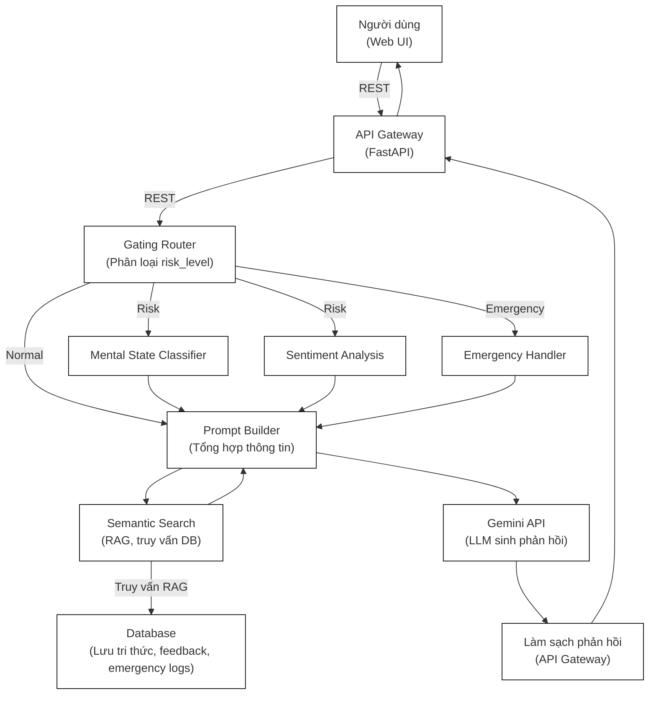

# 🧠 Mental Health Chatbot

**Mental Health Chatbot** là hệ thống hỗ trợ tâm lý ứng dụng AI, sử dụng mô hình ngôn ngữ lớn (LLM) và các tầng phân tích rủi ro để đảm bảo an toàn, cá nhân hóa phản hồi và xử lý khẩn cấp khi cần thiết.

---

## 🚦 Kiến trúc & Flow tổng quan

Hệ thống chatbot được thiết kế với các tầng xử lý rõ ràng, đảm bảo an toàn, cá nhân hóa và phản hồi linh hoạt. Sơ đồ dưới đây thể hiện kiến trúc tổng quan, chức năng từng module và luồng xử lý chính:



### Luồng xử lý chính:

1. **Người dùng** gửi message qua Web UI
2. **API Gateway** nhận message và chuyển cho **Gating Router**
3. **Gating Router** phân loại risk_level:
   - **Normal**: → Tạo prompt trực tiếp
   - **Risk**: → Gọi **Mental State Classifier** & **Sentiment Analysis** để phân tích trạng thái tâm thần và cảm xúc, sau đó mới tạo prompt
   - **Emergency**: → Gọi **Emergency Handler** để cảnh báo, đồng thời thêm thông tin vào prompt
4. **Semantic Search** truy vấn DB (RAG) để lấy thông tin liên quan, bổ sung vào prompt
5. **Prompt Builder** tổng hợp tất cả thông tin (message, risk, cảm xúc, trạng thái, tri thức từ DB)
6. **Gemini API** (hoặc LLM khác) sinh phản hồi dựa trên prompt hoàn chỉnh
7. **API Gateway** làm sạch, chuẩn hóa phản hồi trước khi trả về UI

### Chức năng từng module:
- **Người dùng (Web UI)** (*Giao diện trò chuyện cho người dùng cuối*)
- **API Gateway (FastAPI)** (*Trung tâm điều phối, nhận message, gọi các service, trả kết quả về frontend*)
- **Gating Router** (*Phân loại mức độ rủi ro: normal, risk, emergency cho từng message*)
- **Mental State Classifier** (*Phân loại trạng thái tâm thần, phát hiện dấu hiệu bất thường*)
- **Sentiment Analysis** (*Phân tích cảm xúc, hỗ trợ cá nhân hóa phản hồi*)
- **Emergency Handler** (*Xử lý khẩn cấp, cảnh báo, gọi hotline, ghi log sự kiện nguy hiểm*)
- **Semantic Search (RAG)** (*Truy vấn database để lấy tri thức liên quan, bổ sung vào prompt*)
- **Database** (*Lưu tri thức, feedback, emergency logs, không lưu lịch sử hội thoại trực tiếp*)
- **Prompt Builder** (*Tổng hợp tất cả thông tin để tạo prompt hoàn chỉnh*)
- **Gemini API** (*LLM chính, sinh phản hồi dựa trên prompt được xây dựng*)

> Sơ đồ trên giúp người mới dễ hình dung toàn bộ luồng xử lý và vai trò từng thành phần trong hệ thống chatbot AI hỗ trợ tâm lý.

---

## 🏗️ Kiến trúc chi tiết các thành phần

### 1. API Gateway (`api_gateway/api.py`)
- **Port**: 8000
- **Chức năng**: Trung tâm điều phối, xử lý toàn bộ pipeline
- **Endpoints chính**:
  - `POST /chat` - Main chat endpoint
  - `POST /feedback` - Xử lý feedback từ user
  - `POST /emergency` - Xử lý tình huống khẩn cấp
  - `GET /health` - Health check
  - `GET /feedback/stats` - Thống kê feedback

### 2. Gating Router (`services/gating_router/`)
- **Chức năng**: Phân loại mức độ rủi ro của message
- **Output**: normal, risky, emergency
- **Model**: Fine-tuned classifier cho mental health domain

### 3. Mental State Classifier (`services/mental_state_classifier/`)
- **Chức năng**: Phân loại trạng thái tâm thần
- **Output**: depression, anxiety, normal, etc.
- **Sử dụng**: Khi risk_level = "risky" hoặc "emergency"

### 4. Sentiment Analysis (`services/sentiment_analysis/`)
- **Chức năng**: Phân tích cảm xúc
- **Output**: positive, negative, neutral
- **Sử dụng**: Khi risk_level = "risky" hoặc "emergency"

### 5. Emergency Handler (`services/emergency_handler/`)
- **Chức năng**: Xử lý tình huống khẩn cấp
- **Actions**: Cảnh báo, gọi hotline, thông báo staff
- **Sử dụng**: Khi risk_level = "emergency"

### 6. Semantic Search (`services/semantic_search.py`)
- **Chức năng**: Truy vấn tri thức liên quan (RAG)
- **Database**: MongoDB với vector embeddings
- **Output**: Các đoạn tri thức có độ liên quan cao

### 7. Prompt Builder (`services/gating_router/prompt_builder.py`)
- **Chức năng**: Tổng hợp thông tin thành prompt hoàn chỉnh
- **Input**: Message, risk_level, sentiment, mental_state, knowledge
- **Output**: Prompt được format cho LLM

### 8. Gemini API Integration
- **Chức năng**: LLM chính để sinh phản hồi
- **Input**: Prompt từ Prompt Builder
- **Output**: Phản hồi tự nhiên, thông minh

### 9. Database (MongoDB)
- **Collections**:
  - `conversations` - Lưu feedback và emergency logs
  - `user_feedback` - Feedback từ user
  - `emergency_logs` - Log tình huống khẩn cấp
  - `mental_state_history` - Lịch sử trạng thái tâm thần

---

## 📦 Cấu trúc thư mục đã tối ưu hóa

```bash
DoAnTotNghiep/
├── api_gateway/               # API Gateway (FastAPI backend)
│   ├── __init__.py
│   ├── main.py               # Main API server
│   └── chatbot_api.py        # Chatbot-specific routes
├── chatbot_inference.py      # Script inference chatbot
├── config.py                 # File cấu hình chung
├── Database/                 # Quản lý database
│   └── core.py
├── Dataset/                  # Dữ liệu huấn luyện/thô
├── docker-compose.yml        # Docker setup tổng
├── docker-compose.inference.yml # Docker cho inference
├── Dockerfile                # Docker build chính
├── Dockerfile.frontend       # Docker build frontend
├── Dockerfile.inference      # Docker build inference
├── Dockerfile.pytorch        # Docker build cho PyTorch
├── Docs/                     # Tài liệu dự án
│   └── API.md
├── download_llama_model.py   # Script tải model LLaMA
├── env.example               # Mẫu file biến môi trường
├── frontend/                 # Giao diện người dùng (Gradio UI)
│   ├── __init__.py
│   ├── app.py                # Ứng dụng frontend chính
│   └── features_ui.txt       # Mô tả tính năng UI
├── generate_dataset_chatbot.txt # Hướng dẫn tạo dataset
├── logs/                     # Log files
├── model_server.py           # Model inference server
├── models/                   # Định nghĩa & trọng số model
│   ├── __init__.py
│   ├── chatbot_model.py      # Interface chatbot
│   ├── exllama_chatbot.py    # Tích hợp ExLlama
│   ├── gemini.py             # Tích hợp Gemini
│   ├── gpt.py                # Tích hợp GPT
│   ├── llama.py              # Tích hợp LLaMA
│   ├── model_router.py       # Định tuyến model
│   └── weights/              # Trọng số model
├── Notebook/                 # Notebook Jupyter
├── OPTIMIZATION_SUMMARY.md   # Tổng kết tối ưu hóa
├── PROJECT_STATUS.md         # Trạng thái dự án
├── pyproject.toml            # Cấu hình Python project
├── quick_test.py             # Script test nhanh
├── README_DEV.md             # Tài liệu cho dev
├── README.md                 # Tài liệu chính
├── Reference/                # Tài liệu tham khảo
│   └── Section-I-TV-20230531.pdf
├── requirements.txt          # Danh sách thư viện
├── run_dev.py                # Chạy dev mode
├── run_individual_services.py# Chạy từng service riêng lẻ
├── run_servers.py            # Chạy toàn bộ server
├── scripts/                  # Script hỗ trợ huấn luyện, inference, cài đặt
│   ├── __init__py
│   ├── convert_to_gptq.py
│   ├── docker_manager.py
│   ├── download_alternative_model.py
│   ├── download_base_model.py
│   ├── exllama_inference.py
│   ├── finetune_chatbot.py
│   ├── finetune_qlora.py
│   ├── install_dependencies.py
│   ├── merge_checkpoint.py
│   ├── reorganize_models.py
│   ├── run_exllama_workflow.py
│   ├── run_inference.py
│   ├── run_tests.py
│   ├── setup_exllama.py
│   ├── training.py
│   └── update_requirements.py
├── services/                 # Các service lõi
│   ├── __init__.py
│   ├── chatbot/              # Logic chatbot
│   │   ├── bot_service.py
│   │   ├── gemini_service.py
│   │   ├── inference_service.py
│   │   ├── llama_service.py
│   │   └── response_generator.py
│   ├── common_schemas.py
│   ├── context_tracking/     # Theo dõi ngữ cảnh hội thoại
│   │   └── tracker.py
│   ├── emergency_handler/    # Xử lý khẩn cấp
│   │   ├── __init__.py
│   │   ├── handler.py
│   │   ├── hotline_caller.py
│   │   ├── README.md
│   │   └── staff_notifier.py
│   ├── gating_router/        # Định tuyến/phân loại rủi ro
│   │   ├── __init__.py
│   │   ├── prompt_builder.py
│   │   ├── quick_check.py
│   │   └── router.py
│   ├── mental_state_classifier/ # Phân loại trạng thái tâm thần
│   │   ├── classifer.py
│   │   ├── config/
│   │   │   ├── labels.json
│   │   │   ├── settings.py
│   │   │   └── thresholds.json
│   │   └── utils/
│   │       └── text_preprocessor.py
│   ├── setiment_analysis/    # Phân tích cảm xúc
│   │   └── analyzer.py


├── setup_dev.py              # Script setup cho dev
├── setup.py                  # Cài đặt package
├── status_dev.py             # Kiểm tra trạng thái dev
├── stop_dev.py               # Dừng dev server
├── test_checkpoint_1000.py   # Test checkpoint model
├── test_gating_router.py     # Test router phân loại
├── tests/                    # Unit test
│   ├── __init__.py
│   ├── test_api_manual.py
│   ├── test_api.py
│   ├── test_emergency_handler.py
│   ├── test_generator.py
│   ├── test_merged_model.py
│   └── test_tokens.py
├── utils/                    # Tiện ích chung
│   ├── __init__.py
│   ├── api_manager.py
│   ├── common.py
│   ├── data_loader.py
│   ├── logger.py
│   ├── semantic_search.py
│   └── token_loader.py
```

---

## ⚡️ Cài đặt & chạy thử

### 1. Clone repo & cài thư viện
```bash
git clone https://github.com/your-username/mental-health-chatbot.git
cd mental-health-chatbot
pip install -r requirements.txt
```

### 2. Thiết lập biến môi trường
Tạo file `.env` từ mẫu `.env.example` và điền các thông tin:
```env
GEMINI_API_KEY=your_gemini_key
DATABASE_URL=sqlite:///chatbot.db
DEBUG=true
```

### 3. Chạy hệ thống

#### Development Mode
```bash
# Chạy cả API Gateway và Model Server
python run_servers.py
```

#### Production Mode
```bash
# Chạy với Docker
docker-compose up -d
```

### 4. Test API

#### Health Check
```bash
# API Gateway
curl http://localhost:8000/health

# Model Server  
curl http://localhost:8001/health
```

#### Chat với LLaMA
```bash
curl -X POST http://localhost:8000/api/v1/chat \
  -H "Content-Type: application/json" \
  -d '{"message": "Tôi cảm thấy buồn", "prefer_model": "llama"}'
```

#### Chat với Gemini
```bash
curl -X POST http://localhost:8000/api/v1/chat \
  -H "Content-Type: application/json" \
  -d '{"message": "Tôi cảm thấy buồn", "prefer_model": "gemini"}'
```

#### Auto mode (thử LLaMA trước, fallback Gemini)
```bash
curl -X POST http://localhost:8000/api/v1/chat \
  -H "Content-Type: application/json" \
  -d '{"message": "Tôi cảm thấy buồn", "prefer_model": "auto"}'
```

---

## 🚀 ExLlama GPTQ Inference Setup

### 1. Setup Environment
```bash
# Cài đặt ExLlama và dependencies
python scripts/setup_exllama.py
```

### 2. Convert Fine-tuned Model to GPTQ
Sau khi fine-tune xong, convert model từ LoRA adapter sang GPTQ format:

```bash
python scripts/convert_to_gptq.py \
    --base_model "meta-llama/Llama-3.2-1B-Instruct" \
    --lora_path "models/weights/chatbot_finetuned_nf4" \
    --output_path "models/weights/chatbot_gptq" \
    --bits 4 \
    --group_size 128
```

### 3. Run Inference

#### Test Generation
```bash
python scripts/exllama_inference.py \
    --model_path "models/weights/chatbot_gptq" \
    --test
```

#### Interactive Chat
```bash
python scripts/exllama_inference.py \
    --model_path "models/weights/chatbot_gptq" \
    --interactive
```

#### Tích hợp vào hệ thống hiện tại
```python
from models.exllama_chatbot import create_exllama_chatbot

# Tạo chatbot instance
chatbot = create_exllama_chatbot("models/weights/chatbot_gptq")

# Sử dụng
response, emotion = chatbot.chat_response("Tôi cảm thấy căng thẳng")
print(f"Response: {response}")
print(f"Emotion: {emotion}")
```

### Performance Comparison

| Method | Memory Usage | Speed | Quality |
|--------|-------------|-------|---------|
| Original (FP16) | ~6GB | 1x | Baseline |
| LoRA (4-bit) | ~2GB | 0.8x | Good |
| GPTQ (4-bit) | ~1.5GB | 1.2x | Good |
| ExLlama GPTQ | ~1.2GB | 1.5x | Good |

---

## 📊 API Response Format

```json
{
  "response": "Tôi hiểu cảm xúc của bạn...",
  "sentiment": "negative",
  "mental_state": "depression", 
  "risk_level": "risky",
  "source": "llama_model_server",
  "warning": "⚠️ RỦI RO: Bạn có thể cân nhắc...",
  "model_used": "llama"
}
```

---

## 🛠️ Development

### 1. Fine-tune Model
```bash
# Fix và chạy training
python fix_and_train.py
```

### 2. Test Model Server
```bash
# Chạy riêng Model Server
python model_server.py

# Test generation
curl -X POST http://localhost:8001/generate \
  -H "Content-Type: application/json" \
  -d '{"prompt": "Tôi cảm thấy buồn"}'
```

### 3. Test API Gateway
```bash
# Chạy riêng API Gateway
uvicorn api_gateway.main:app --host 0.0.0.0 --port 8000 --reload
```

---

## 🚨 Troubleshooting

### Model Server không start
```bash
# Kiểm tra GPU
nvidia-smi

# Kiểm tra model path
ls models/weights/chatbot_finetuned/

# Check logs
tail -f logs/model_server.log
```

### API Gateway lỗi
```bash
# Kiểm tra Model Server
curl http://localhost:8001/health

# Check logs
tail -f logs/api_gateway.log
```

### CUDA Out of Memory (ExLlama)
```bash
# Giảm max_seq_len và max_input_len
python scripts/exllama_inference.py \
    --model_path "models/weights/chatbot_gptq" \
    --max_seq_len 1024 \
    --max_input_len 256
```

---

## 📝 Tùy chỉnh & mở rộng
- **Thay đổi templates hội thoại:** Sửa trong `_create_conversation_templates()`
- **Điều chỉnh số lượt hội thoại:** Sửa trong `_generate_multi_turn_conversation()`
- **Thêm expert mới:** Thêm mô-đun vào `services/` và cập nhật logic routing.

---

## 📚 Tham khảo & đóng góp
- Nếu bạn muốn đóng góp, hãy tạo pull request hoặc issue mới.
- Đọc thêm tài liệu chi tiết trong thư mục `Docs/`.
- Xem `services/emergency_handler/README.md` cho thông tin về Emergency Handler.
- Xem `IMPROVED_GENERATOR_README.md` cho thông tin về Data Generation.

---

**Liên hệ hỗ trợ:**
- Email: your.email@example.com
- Hotline khẩn cấp: 0984.104.115
