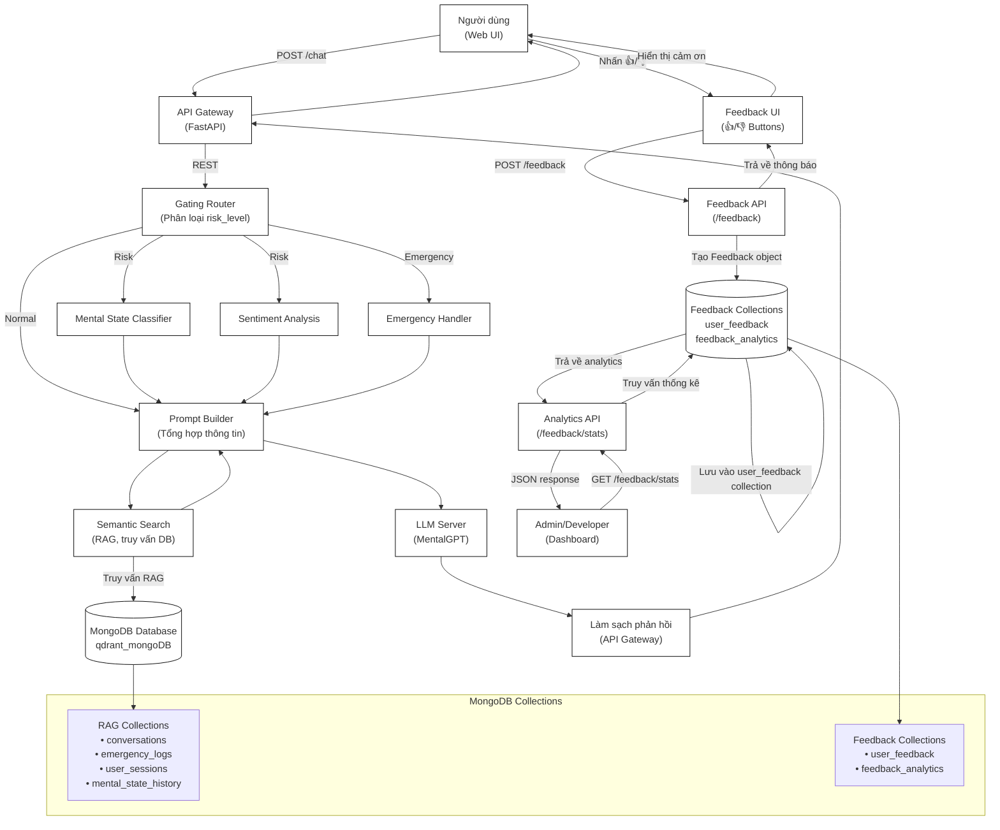
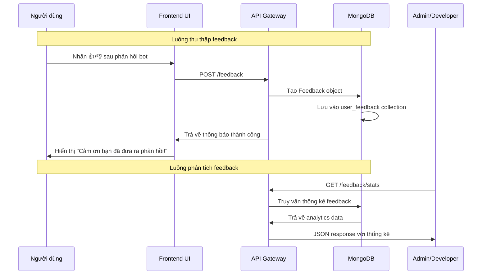
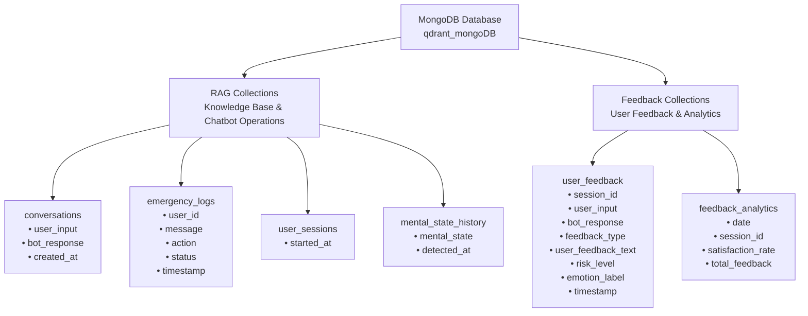

# 🧠 Kiến trúc Hệ thống Chatbot Tâm lý - Tích hợp Feedback System

## 🚦 Kiến trúc & Flow tổng quan (Tích hợp Feedback)

Hệ thống chatbot được thiết kế với các tầng xử lý rõ ràng, bao gồm cả tính năng feedback để cải thiện chất lượng phản hồi. Sơ đồ dưới đây thể hiện kiến trúc tổng quan với tích hợp feedback system:



## 📊 Chi tiết Luồng Xử lý Feedback

### **1. Luồng Thu thập Feedback**



### **2. Cấu trúc Database Collections**



## 🔄 Tích hợp với Kiến trúc Hiện tại

### **Chức năng từng module (Cập nhật):**

- **Người dùng (Web UI)** (*Giao diện trò chuyện + Feedback buttons*)
- **API Gateway (FastAPI)** (*Trung tâm điều phối + Feedback endpoints*)
- **Gating Router** (*Phân loại mức độ rủi ro: Normal, Risk, Emergency*)
- **Mental State Classifier** (*Phân loại trạng thái tâm thần*)
- **Sentiment Analysis** (*Phân tích cảm xúc*)
- **Emergency Handler** (*Xử lý khẩn cấp*)
- **Semantic Search (RAG)** (*Truy vấn database để lấy thông tin liên quan*)
- **Database** (*Lưu lịch sử hội thoại, tri thức, log, cảnh báo + Feedback data*)
- **Prompt Builder** (*Tổng hợp tất cả thông tin*)
- **LLM Server** (*MentalGPT model sinh phản hồi*)
- **Làm sạch phản hồi** (*Chuẩn hóa, format phản hồi*)
- **Feedback System** (*Thu thập và phân tích phản hồi người dùng*)

### **Luồng xử lý chính (Tích hợp Feedback):**

1. **User** gửi message qua Web UI
2. **API Gateway** nhận message qua REST, chuyển cho **Gating Router**
3. **Gating Router** phân loại risk_level:
   - **Normal:** → Tạo prompt trực tiếp
   - **Risk:** → Gọi **Mental State Classifier** & **Sentiment Analysis**
   - **Emergency:** → Gọi **Emergency Handler**
4. **Semantic Search** truy vấn DB (RAG) để lấy thông tin liên quan
5. **Prompt Builder** tổng hợp tất cả thông tin thành prompt hoàn chỉnh
6. **LLM Server** sinh phản hồi dựa trên prompt → trả về **API Gateway**
7. **API Gateway** làm sạch, chuẩn hóa phản hồi → gửi về **UI** cho người dùng
8. **User** đánh giá phản hồi (👍/👎) → **Feedback System** thu thập và lưu trữ
9. **Admin/Developer** truy cập analytics để phân tích và cải thiện hệ thống

## 📈 API Endpoints (Tích hợp Feedback)

### **API Gateway (Port 8000)**
- `POST /chat` — Main chat endpoint
- `POST /feedback` — Thu thập feedback từ người dùng
- `GET /feedback/stats` — Thống kê feedback
- `GET /feedback/dislikes` — Danh sách feedback tiêu cực
- `POST /feedback/export` — Xuất dữ liệu feedback
- `GET /health` — Health check
- `POST /emergency` — Emergency handling
- `POST /semantic_search` — RAG search

### **LLM Server (Port 8001)**
- `POST /model/generate/` — Generate streaming response
- `GET /health` — Health check Model Server

## 🎯 Lợi ích của Tích hợp Feedback

1. **Cải thiện chất lượng**: Sử dụng feedback để fine-tune model
2. **Phân tích xu hướng**: Theo dõi satisfaction rate theo thời gian
3. **Phát hiện vấn đề**: Xác định các phản hồi có vấn đề để khắc phục
4. **Cá nhân hóa**: Điều chỉnh phản hồi dựa trên feedback pattern
5. **Ra quyết định**: Cung cấp dữ liệu để đưa ra quyết định cải tiến

## 🔧 Cấu hình Database Indexes

```python
# RAG Collections indexes
conversations.create_index([("created_at", -1)])
emergency_logs.create_index([("user_id", 1)])
emergency_logs.create_index([("timestamp", -1)])
user_sessions.create_index([("started_at", -1)])
mental_state_history.create_index([("detected_at", -1)])

# Feedback Collections indexes
user_feedback.create_index([("session_id", 1)])
user_feedback.create_index([("feedback_type", 1)])
user_feedback.create_index([("timestamp", -1)])
user_feedback.create_index([("risk_level", 1)])
user_feedback.create_index([("emotion_label", 1)])
feedback_analytics.create_index([("date", -1)])
feedback_analytics.create_index([("session_id", 1)])
```

Hệ thống được thiết kế với kiến trúc microservice, tách biệt rõ ràng giữa các thành phần và đảm bảo khả năng mở rộng, bảo trì dễ dàng. Feedback system được tích hợp một cách mượt mà vào luồng xử lý chính mà không làm ảnh hưởng đến hiệu suất của hệ thống. 